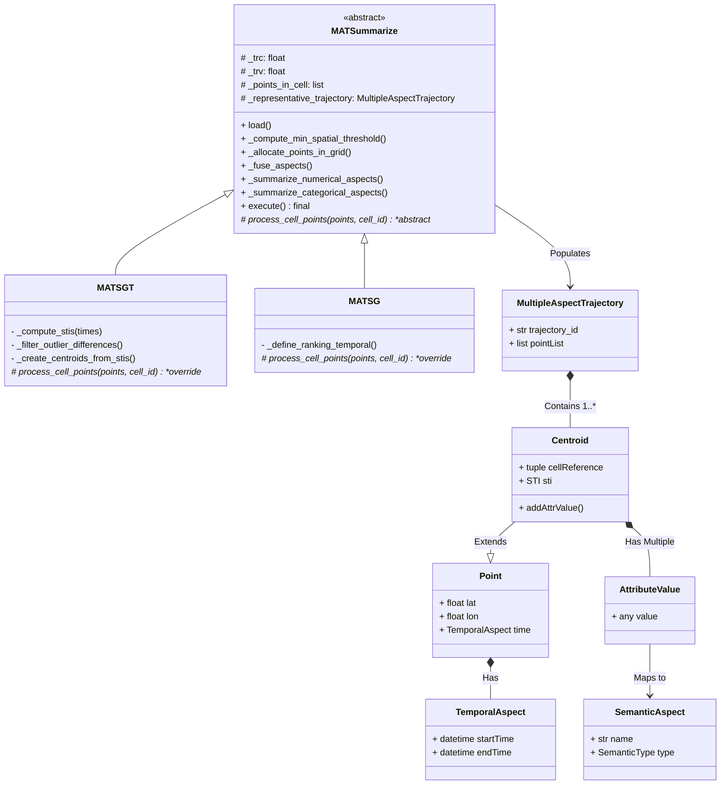

# MAT-data: Multiple Aspect Trajectory Summarization Modeling (MAT-SG & MAT-SGT)

This repository contains the Python implementation for **Multiple Aspect Trajectory Summarization** algorithms. Initially based on Java, the **MAT-SG** (Multiple-Aspect Trajectories based on a spatial Grid) and **MAT-SGT** (Multi-Aspect Trajectories Based on Spatio-Temporal Segmentation) models were rewritten and optimized in object-oriented Python under the **Template Method** design pattern aiming at processing massive data of enriched trajectories.

## 📌 Project Overview

The central goal of this library is to reduce large volumes of trajectory points while maintaining spatial, temporal, and semantic fidelity through the agglomeration and definition of representative points that carry proportional semantics (e.g., Weather, POI locations, Prices, etc.).

The semantic accumulation supports fusion of both **Numerical** variables that generate average scores via median, and **Categorical** variables, preserving the weighted/proportional distribution of values within the consolidated clusters.

### 📍 Available Algorithm Patterns

There are two fundamental variations of spatial analysis applied to this model. For a complete theoretical foundation, access the [Approaches (MAT-SG vs MAT-SGT)](docs/approaches.md) guide.

1. **MAT-SG**: (Multiple-Aspect Trajectories based on a spatial Grid) agglomerates elements limited only to the **Spatial** threshold and grid, and fuses the semantics to generate mathematically calculated representative centroid points, discarding excessive points (`outliers`).
2. **MAT-SGT**: (Multi-Aspect Trajectories Based on Spatio-Temporal Segmentation) also adds the **Temporal** threshold, partitioning sub-cells that besides being spatially close, also co-exist in the same contiguous time interval partition of the day, grouping sub-intervals that compose time and space (`STI - Spatial-Temporal Intervals`).

---

## 🏗 Repository Structure and Architecture

The repository is architected following clean formal patterns focused on the **Template Method**. For a deep dive into the separation technique, refer to the [Architecture and Inheritance](docs/architecture.md) documentation.

### Class Architecture (Template Method)



### Directory Layout

```text
/
├── README.md            # Entry point project documentation
├── docs/                # Extended project documentation (approaches and architecture guides)
├── logs/                # Directory reserved for execution streams and debugging
├── data/                # Local datasets manipulation
│   ├── input/           # CSV spreadsheet repository for raw modeling
│   └── output/          # Representative trajectories extracted by the model (.csv)
├── method/              # Contains the clustering and summarization methods logic
│   ├── MATSummarize.py  # Base Abstract Class (Template Method Pattern)
│   ├── MATSG.py         # Subclass applying Spatial heuristics
│   ├── MATSGT.py        # Subclass adding partitioning via Time STIs
│   └── MUITAS.py        # Algorithmic univariate scoring calculations
├── model/               # Structural and Geometric Models
│   ├── AttributeValue.py# Embedded dictionaries of <Aspect:Value> (e.g., {WEATHER: "CLOUDS"})
│   ├── Centroid.py      # Groups Space-Time cuts
│   ├── Point.py         # Abstract elements of raw Lat/Lon 
│   ├── SemanticAspect.py# Dimensional treatment
│   ├── TemporalAspect.py# Datetime utility wrapper 
│   └── Util.py          # Global Euclidean distances and cKDTree mappings
└── execution/           # Entry Point and Main Runner
    └── runner.py        # Local script orchestrator
```

---

## 🚀 How to Install and Run

**Prerequisites**:
*   Python 3.10+
*   Libraries from `requirements.txt` (Ex: `pandas`, `numpy`, `scipy`)

**1. Clone and Prepare the Environment**
```bash
git clone https://github.com/YourUser/MAT-data.git
cd MAT-data/rt2v-model-update
pip install -r requirements.txt
```

**2. Running a Quick Test (`runner.py`)**

A mock test environment and base orchestration are prepared in the `execution/` folder. It points the extractions directly to the input and output reciprocals of the `data/` folder.

```python
# In execution/runner.py
from method.MATSGT import MATSGT

# 1. Instantiate the class pointing the datasets dynamically
model_sgt = MATSGT(
    trc=0.25,
    trv=0.25,
    path=os.path.join(INPUT_DIR, 'Running_Example_v5.csv')
)

# 2. Execute the method passing base traits and dump location
model_sgt.execute(
    lst_categorical_pd=['price'],  # columns forced to act as discrete string
    values_null=[-1, -999],        # Null/empty values of your raw dataset 
    pattern_date_input='?',        # Date regex/patterns or ? for default full-day minute format (24h)
    dir=f"{OUTPUT_DIR}/", # Automatic directory resolved by the OS for dump         
    file='teste_saida',
    rc=0.25,
    trv=0.25,
    ignore_columns=None
)
```

**3. Resulting Output**
The execution will export the dataset history under a CSV document:
`teste_saida rc 25 rv 25 - zX.csv` 

Upon opening it, it will display the list of points condensed numerically and temporally (with dict-like markings for varied attributes such as `{23:20 - 23:30 prop: 0.33}`). The header will detail the Method used, Coverage, and the amount of Reduction executed over the input root sample.

---

## 🛠️ Recent Refactoring Contributions (Changelog)

-   Architectural migration based purely on base **Classic Python (`snake_case`)** OOP, eliminating legacy Java *camelCase* fragments;
-   Integration of the **Template Method** encapsulation Pattern concentrating inheritance and abstraction in the parent file *`MATSummarize.py`*, reducing redundant code by >50%;
-   Fixed the `Java Skip Indexing` bug, refining the accuracy with what the Outlier Removal Process eliminates (where before they were accidentally spared);
-   100% reliable adherence to probability normalization to yield a real-mathematical `sum = 1.0`.
-   Removal of Dead Code through scanning (`Vulture` specs).

## 📄 Model Authors / Contact
Research referenced in **Representations and Clustering of Traces with Multiple Semantics for Smart Cities**. Developed with academic support and adaptation via IFSUL and original MAT-data repository.

For formal and architectural in-depth understanding based on the original research articles, refer to:
- **MAT-SG ([Springer Link](https://link.springer.com/chapter/10.1007/978-3-031-12423-5_33))**: *Multiple-Aspect Trajectory Summarization based on a spatial Grid*
- **MAT-SGT ([JIDM](https://journals-sol.sbc.org.br/index.php/jidm/article/view/4110))**: *Multiple-Aspect Trajectory Summarization via Grid and Time*
