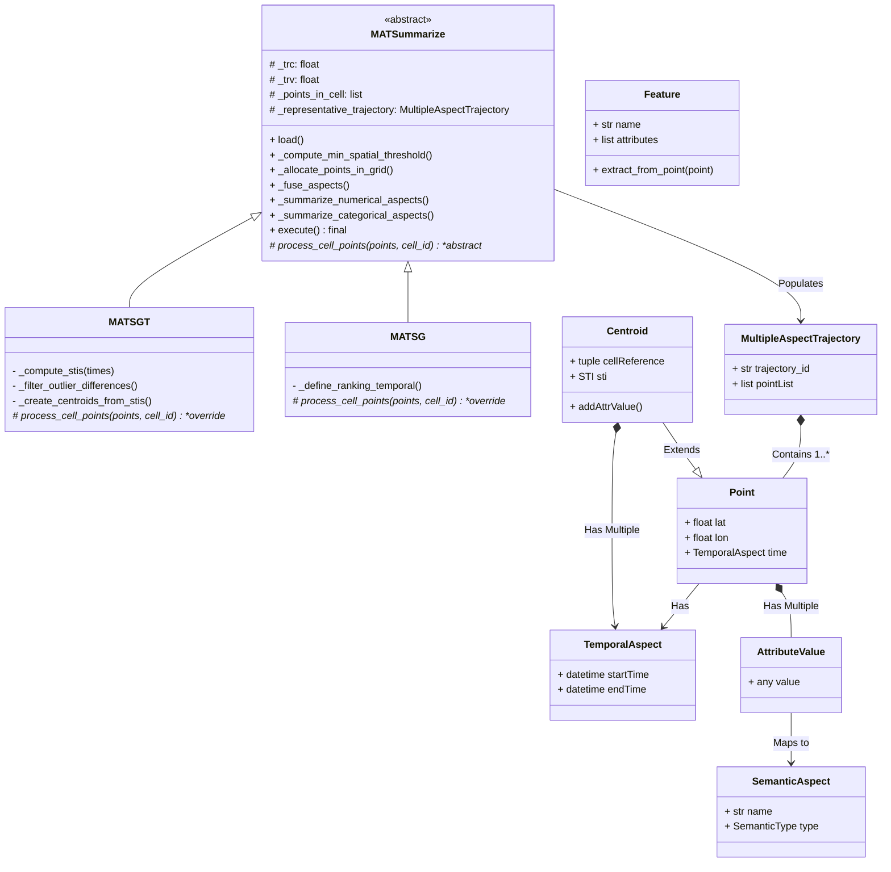

# MAT-data: Multiple Aspect Trajectory Summarization Modeling (MAT-SG & MAT-SGT)

[](https://www.python.org/downloads/)
[](https://www.gnu.org/licenses/gpl-3.0)
[](https://badge.fury.io/py/mat-summarize)

This repository contains the Python implementation for **Multiple Aspect Trajectory Summarization** algorithms. Initially based on Java, the **MAT-SG** (Multiple-Aspect Trajectories based on a Spatial Grid) and **MAT-SGT** (Multi-Aspect Trajectories Based on Spatio-Temporal Segmentation) models were rewritten and optimized in object-oriented Python using the **Template Method** design pattern to process massive datasets of enriched trajectories.

## 📌 Project Overview

The central goal of this library is to reduce large volumes of trajectory points while maintaining spatial, temporal, and semantic fidelity. This is achieved through the **clustering and definition of representative points** that carry proportional semantics (e.g., Weather, POI locations, Prices, etc.).

The semantic clustering supports the summarization of both **Numerical** variables, which generate average scores via the median, and **Categorical** variables, preserving the weighted/proportional distribution of values within the consolidated clusters.

### 📍 Available Algorithm Patterns

There are two fundamental variations of spatial analysis applied in this model. For a complete theoretical foundation, refer to the [Approaches (MAT-SG vs MAT-SGT)](docs/approaches.md) guide.

1. **MAT-SG** (Multiple-Aspect Trajectories based on a Spatial Grid): Clustering elements based solely on a **Spatial** threshold and grid. It summarizes semantics to generate mathematically calculated representative centroid points while discarding excessive outlier points.
2. **MAT-SGT** (Multi-Aspect Trajectories Based on Spatio-Temporal Segmentation): Incorporates a **Temporal** threshold, clustering spatial cells that are not only spatially close but also co-exist within the same contiguous time interval of the day. This groups spatial cells that compose time and space (`STI` - Spatial-Temporal Intervals).

### 🔗 Feature-Based Extension (Semantic Dependency)
Both MAT-SG and MAT-SGT were extended to extract **Composed Features**. Instead of summarizing attributes independently (which loses context, like assuming a POI and a Price have no relation), the framework allows users to explicitly define dependencies (e.g., `(POI, Price)`), when user identifyied the need to do so, in order to preserve the contextual distribution (e.g., preserving that `{Restaurant, 20}` happened together). For details, see [Feature-Based Summarization](docs/Feature_Summarization_Method.md).

---

## 🏗 Repository Structure and Architecture

The repository is structured following clean formal design patterns, specifically leveraging the **Template Method**. For a deep dive into the architectural design, refer to the [Architecture and Inheritance](docs/architecture.md) documentation.

### Class Architecture (Template Method)



### Directory Layout

```text
/
├── README.md                       # Entry point project documentation
├── docs/                           # Extended project documentation (approaches and architecture guides)
├── data/                           # Local datasets manipulation
│   ├── input/                      # CSV spreadsheet repository for raw modeling
│   └── output/                     # Representative trajectories extracted by the model (.csv)
├── src/mat_summarize/              # Main package
│   └── method/                     # Contains the clustering and summarization methods logic
│       ├── MATSummarize.py         # Base Abstract Class (Template Method Pattern)
│       ├── MATSG.py                # Subclass applying Spatial heuristics
│       ├── MATSGT.py               # Subclass adding partitioning via Time STIs
│       ├── FeatureAggregator.py    # Extracts and distributes composed features
│       └── MUITAS.py               # Algorithmic univariate scoring calculations
│   └── model/                      # Structural and Geometric Models
│       ├── Feature.py              # User-defined composed attributes structure
│       ├── AttributeValue.py       # Embedded dictionaries of <Aspect:Value> (e.g., {WEATHER: "CLOUDS"})
│       ├── Centroid.py             # Groups Space-Time cuts
│       ├── Point.py                # Abstract elements of raw Lat/Lon 
│       ├── SemanticAspect.py       # Dimensional treatment
│       ├── TemporalAspect.py       # Datetime utility wrapper 
│       └── Util.py                 # Global Euclidean distances and cKDTree mappings
```

---

## 🚀 How to Install and Run

### Prerequisites
*   Python 3.9 or later
*   NumPy
*   Pandas
*   SciPy

### 1. Installation

Install the package from PyPI using `pip`:

```bash
pip install mat-summarize
```

**For local development:**
Clone the repository and install it in editable mode:
```bash
git clone https://github.com/RepresentantativeMAT/mat-summarization.git
cd mat-summarization
pip install -e .
```

### 2. Running MAT-Summarize

#### Step 1: Import a Method

MAT-Summarize provides two main methods: `MATSG` and `MATSGT`. Import the method you want to use:

```python
from mat_summarize.method import MATSGT
```

#### Step 2: Initialize the Method

Create an instance of the selected method:

```python
model_sgt = MATSGT(
    trc=0.25,
    trv=0.25,
    path='test_input.csv'
)
```

The constructor accepts the following parameters:

| Parameter | Description                                                                |
| --------- | -------------------------------------------------------------------------- |
| `trc`     | Threshold for relevant cells (`tauRelevantCell`).                          |
| `trv`     | Threshold for the representativeness value (`tauRepresentativenessValue`). |
| `path`    | Path to the input dataset.                                                 |

#### Step 3: Execute the Method

Run the method using the `execute()` function:

```python
model_sgt.execute(
    lst_categorical_pd=['price'],
    values_null=[-1, -999],
    dir='data/',
    file='test_output',
    ignore_columns=None,
    features=[('poi',), ('price',), ('weather', 'precip')]
)
```

The `execute()` function accepts the following parameters:

| Parameter            | Description                                                                                                                                                                                             |
| -------------------- | ------------------------------------------------------------------------------------------------------------------------------------------------------------------------------------------------------- |
| `lst_categorical_pd` | List of numerical columns that should always be treated as categorical. Default value is None, meaning that all columns will be treated as numerical values by default if is composed by numbers.                   |
| `values_null`        | List of values that represent missing data. Default value is None, indicating that there are no null values to be treated.                                                                              |
| `dir`                | Path to the output directory.                                                                                                                                                                                                                                            |
| `file`               | Name of the output file.                                                                                                                                                                                                                                               |
| `ignore_columns`     | List of dataset columns to exclude from processing. Use `None` to include all columns.                                                                                                                   |
| `features`           | List of tuples specifying the attributes to be used by the method.                                                                                       |

#### Complete Example

```python
from mat_summarize.method import MATSGT

model_sgt = MATSGT(
    trc=0.25,
    trv=0.25,
    path='test_input.csv'
)

model_sgt.execute(
    lst_categorical_pd=['price'],
    values_null=[-1, -999],
    dir='data/',
    file='test_output',
    ignore_columns=None,
    features=[('poi',), ('price',), ('weather', 'precip')]
)
```

### 3. Output

After execution, MAT-Summarize exports the dataset history as a CSV file.

For the example above, the output file will be named:

```text
test_output rc 25 rv 25 - zX.csv
```

The resulting CSV contains a numerical and temporal condensation of the input data. Some attributes may be represented using dictionary-like notation, such value example for the POI attribute:

```text
{HOME: 0.67; LIBRARY: 0.33}
```

The output header provides information about:

* The method used.
* The coverage achieved.
* The reduction applied to the original dataset.

This allows you to evaluate how the input data was condensed while preserving relevant information.

---

## 🛠️ Recent Refactoring Contributions (Changelog)

-   Architectural migration based entirely on **Classic Python (`snake_case`)** OOP, eliminating legacy Java *camelCase* fragments.
-   Integration of the **Template Method** design pattern, concentrating inheritance and abstraction in the parent class `MATSummarize.py`, reducing redundant code by over 50%.
-   Fixed the `Java Skip Indexing` bug, refining the accuracy of the Outlier Removal Process (which previously spared some outliers by accident).
-   Reliable adherence to probability normalization, ensuring a mathematical `sum = 1.0`.
-   Removed dead code using `Vulture`.

## 📄 Model Authors / Contact
This research was partially funded by the SoBigData++ Project via Transnational Access (TNA), as well as the European Union’s Horizon 2020 research and innovation programme under GA N. 777695 (EU Project MASTER - Multiple ASpects TrajEctoRy management and analysis) until 2024. 

Currently, this research is associated with the **Análise Avançada de Dados de Trajetórias** project (EDITAL PROPESP 05-2025). We gratefully acknowledge that the conversion of the methods to Python, the extension of the method for the use of Features, and the utilization of the Template Method pattern were realized with the support and assistance of this IFSUL research project.

For a formal and in-depth architectural understanding based on the original research articles, refer to:
- **MAT-SG ([Springer Link](https://link.springer.com/chapter/10.1007/978-3-031-12423-5_33))**: *Multiple-Aspect Trajectory Summarization based on a spatial Grid*
- **MAT-SGT ([JIDM](https://journals-sol.sbc.org.br/index.php/jidm/article/view/4110))**: *Multiple-Aspect Trajectory Summarization via Grid and Time*

## 📞 Contacts
- [Vanessa Lago Machado](mailto:vanessalagomachado@gmail.com)
- [Jonathan Roberto Fragoso Bonatto](mailto:jonathanrfbonatto@gmail.com)