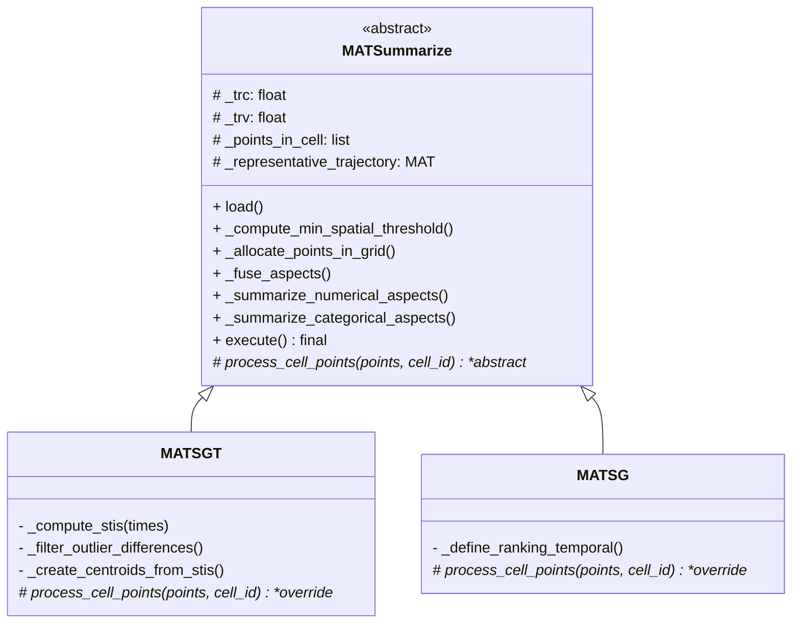

# Análise e Proposta Arquitetural: MATSummarize, MATSG e MATSGT

Esta documentação técnica apresenta a proposta de refatoração estrutural orientada a objetos (OO) para separar a base lógica comum das variações específicas de processamento temporal dos algoritmos MAT-SG e MAT-SGT.

## 1️⃣ Identificação Precisa do que é Comum (Classe Base `MATSummarize`)

A classe base abstrata `MATSummarize` encapsulará todo o arcabouço de dados, engenharia de atributos (features semânticas) e agrupamento espacial inicial, isolando a regra de negócio que independe do tratamento temporal posterior.

**Módulos e lógicas a serem mantidos na super-classe:**
*   **Pipeline Genérico de Inicialização e Carga (`load`)**: Mapeamento do *dataset* para o modelo unificado de objetos (MAT, Point, AttributeValue, SemanticAspect).
*   **Segmentação Espacial e Alocação de Grid**:
    *   `compute_min_spatial_threshold()`: Cálculo global do *threshold* espacial usando as otimizações de `cKDTree`.
    *   `get_cell_position()` / `allocate_all_points_in_space_cell()`: Hash de alocação de pontos do plano 2D nas células do Grid.
*   **Identificação de Células Relevantes**: Parte da rotina que verifica se a cardinalidade de pontos em uma célula `k` excede o limite `trc`.
*   **Sumarização por Dimensão Semântica e Espacial (Grãos-Puros)**: As subrotinas fundamentais de sumarização geométrica e semântica extraídas na refatoração anterior devem morar aqui (como métodos `protected` ou injetados), pois o cálculo puramente estatístico (mediana e moda/ranking) independe da origem dos pontos:
    *   `_fuse_aspects(point)`
    *   `_summarize_numerical_aspects(rep_point)`
    *   `_summarize_categorical_aspects(rep_point)`
*   **Loop Macro de Ajuste de Z (`summarize_trajectories`)**: A lógica de *Fallback* da distância Z para aumentar a precisão de *Cover Points* / Similaridade pode ser gerenciada pela superclasse, desde que delegue a validação temporal aos filhos.

**Justificativa:** Centraliza todo o esforço I/O, métricas base e construção matricial, evitando duplicação na iteração do espaço de hiperparâmetros e processamento espacial, forçando aderência ao princípio *DRY* (Don't Repeat Yourself). O cálculo matemático de medianas e frequência não muda, o que muda é *qual subconjunto de pontos* será entregue ao método de cálculo.

---

## 2️⃣ Identificação do que deve ser Extraído para `MATSGT` (Filho)

A classe atual `MATSummarize` atua, na prática, em grande parte com o escopo do **MAT-SGT**, derivando Pontos Representativos (RPs) a partir do particionamento no tempo. Tudo que aciona o sub-particionamento temporal será extraído.

**Módulos delegados ao MATSGT:**
*   **Cálculo e Extração de STI (Significant Temporal Intervals)**: 
    *   `compute_time_differences()` (e o filtro univariado de remoção de outliers de passo de tempo).
    *   `summarize_temporal_aspect()` e `create_temporal_intervals()`.
*   **Construção de N-Centróides por Célula**: Em vez de resumir os pontos de uma célula iterada em 1 Ponto Representativo (RP), o MAT-SGT seleciona pontos temporalmente adjacentes (`isInInterval()`) e aloca **múltiplos RPs** para a mesma célula espacial caso possuam STIs distintos e expressivos (>= `TRV`).
*   **Ordenação Temporal (Narrativa)**: O passo de cronologizar (`asort_temporal_intervals()`) os múltiplos intervalos para manter a consistência da formação do MAT Representativo de saída.

**Justificativa:** O conceito de intervalo iterativo de passo regular (STI) é estritamente proprietário do MAT-SGT no intuito de montar trajetórias representativas sequenciais (preservar a restrição narrativa). `MATSG` original desconhece o conceito de STI fatiado como chave de ramificação de RPs.

---

## 3️⃣ Adaptação do `MATSG` Original para Padronização de Saída

Baseado na classe lega `MATSG.java`, o funcionamento do método SG para uma célula elegível é:
Criar **exatamente 1 Centróide (Ponto Representativo)** congregando *todos* os pontos alojados, operando suas medianas espaciais e semânticas. Para compensar a perda cronológica, o MATSG roda um `.defineRankingTemporal` interno nos tempos brutos da célula, gerando *Atributos Categóricos Sintéticos* com nome "TIME" que comportam a distribuição de horários associados àquele único ponto.

**Proposta de Padronização para Padrão Saída Unificado:**
*   **A Abstração Categórica de Tempo**: O MATSG (novo filho Python) instanciará um `Centroid` simples através da lista primária da célula.
*   **Injeção no Modelo**: O mapa de `RankingTemporal` calculado pelo algoritmo SG será injetado nativamente no `Centroid` final usando a função padronizada `rep_point.addAttrValue(mapping, SemanticAspect("TIME", ...))`.
*   Isso torna a Trajetória Computada pelo MATSG um espelho estrutural do MATSGT: uma lista de `Centroids` preenchida com coordenadas, atributos semânticos numéricos, mapas semânticos categóricos, diferindo apenas que o MATSG entregará menos pontos (1/célula), com a dimensão temporal espremida num atributo sintético. Não exigirá um Factory específico, apenas assegurar que `MATSG` instancie e alimente a variável livre genérica herdada `self._representative_trajectory`.

---

## 4️⃣ Proposta Formal de Arquitetura e Estrutura de Classes

A arquitetura utilizará Herança Clássica (Is-A) casada com o padrão **Template Method**.



### Contratos e Hooks
*   **Execução Global**: `MATSummarize.execute()` não será reescrito. Ele fará o Load -> Calc Spatial Limit -> Loop de Células.
*   **O "Hook" Primário**: No momento do loop matricial `identify_times_in_cell()`, ao invés da lógica concreta atual do Python, a superclasse abstrai e chama `self.process_cell_points(cell_points, present_cell_id)`.
*   **Contrato do Hook**: Espera-se que cada filho pegue os pontos entregues, aplique sua regra temporal (Múltiplos RPs via STI no MATSGT, ou Ponto Único com síntese temporal no MATSG), utilize os métodos fechados (`_fuse_aspects`, etc.) da Base Class e por fim apende os `Centroid` gerados na variável de estado herdada `_representative_trajectory`.

---

## 5️⃣ Avaliação do Template Method

O Padrão **Template Method** não só é aplicável como é a decisão estritamente correta para algoritmos científicos que compartilham pipelines longos e invólucros matemáticos idênticos de preparação, com diferenciação profunda inserida em etapas intermédias do cálculo.

**Esqueleto do Template Base:**
```python
# MATSummarize.py (Abstract Base)
def _identify_and_process_cells(self):
    for cell_id, point_ids in self.__spatial_cell_grid.items():
        if len(point_ids) >= self.__trc:
            cell_points = [self.__points[pid - 1] for pid in sorted(point_ids)]
            # --- TEMPLATE HOOK ---
            # Devolve ao filho a decisão cronológica do bloco
            self.process_cell_points(cell_points, cell_id)

@abstractmethod
def process_cell_points(self, cell_points: List[Point], cell_id: Tuple[int, int]):
    pass
```

---

## 6️⃣ Modelo Unificado de Saída (Fidelidade ao .Java)

Garantia de consistência semântica e estrutural. Os artefatos finais de ambos os filhos não retornarão *DataFrames* puros, mas a teia de objetos estipulada no código original `model/`:
*   `MultipleAspectTrajectory` -> Carrega o identificador final e métricas de Cover Points da sumarização.
*   Carrega uma lista (`pointList`) nativa de instâncias `Centroid`, que por definição estendem a interface abstrata `Point`.
*   `Centroid` encapsula a célula 2D de origem, `STI` (se for MATSGT) e lista de `AttributeValue`.
*   O dump em `.csv` se dá lendo a interface final `rp.findAttributeValue()` e empacotando os dicionários internos usando formatação iterativa (O `write_representative_trajectory` estará presente unicamente na Subclasse abstrata).

---

## 7️⃣ Pseudocódigo Detalhado

```python
from abc import ABC, abstractmethod

# ----------------- CLASSE BASE -----------------
class MATSummarize(ABC):
    def __init__(self, ...):
        self._trc = ...
        self._trv = ...
        self._points = []
        self._representative_trajectory = MultipleAspectTrajectory('representative')

    def execute(self):
        self.load()
        self._compute_min_spatial_threshold()
        # Outer Loop Z optimization omitted for clarity
        self._allocate_points_in_grid()
        self._identify_and_process_cells()

    def _identify_and_process_cells(self):
        for cell_id, p_ids in self._spatial_cell_grid.items():
            if len(p_ids) >= self._trc:
                cell_points = [self._points[pid - 1] for pid in sorted(p_ids)]
                self._reset_values_to_summarization()
                # TEMPLATE METHOD DELEGATION
                self.process_cell_points(cell_points, cell_id)
                self._update_representative_trajectory()

    # Métodos Fechados de sumarização Estatística Extrativa (DRY)
    def _compute_numerical_centroid(self, rep_point: Centroid):
        # A lógica comum para apurar mediana já implementada no refactor
        pass

    @abstractmethod
    def process_cell_points(self, cell_points: List[Point], cell_id: Tuple[int, int]):
        """Implementação específica de processamento temporal por célula."""
        pass


# ---------------- MAT-SGT (Filho Temporal Sequencial) ----------------
class MATSGT(MATSummarize):
    
    def process_cell_points(self, cell_points, cell_id):
        times = [p.time.startTime for p in cell_points]
        stis = self._compute_stis(times)
        
        for p in cell_points:
            self._fuse_aspects(p)
            
        for sti in stis:
            if sti.proportion >= self._trv:
                # Cria Múltiplos Centroids por tempo para a mesma célula
                rp = Centroid()
                rp.cellReference = cell_id
                rp.sti = sti
                # Associa os pontos apenas desse STI
                rp.add_points([p for p in cell_points if sti.interval.isInInterval(p.time.startTime)])
                
                self._compute_numerical_centroid(rp)
                self._compute_categorical_centroid(rp)
                
                self._list_rep_point.append(rp)


# ---------------- MAT-SG (Filho Contínuo/Aggregado) ----------------
class MATSG(MATSummarize):
    
    def process_cell_points(self, cell_points, cell_id):
        times = [p.time.startTime for p in cell_points]
        
        # Cria EXATAMENTE UM Centroid congregando todo o tempo desta célula
        rp = Centroid()
        rp.cellReference = cell_id
        
        for p in cell_points:
            rp.addPoint(p)
            self._fuse_aspects(p) # Da Superclasse
            
        self._compute_numerical_centroid(rp)
        self._compute_categorical_centroid(rp)
        
        # Lógica particular do MATSG para construir dimensão temporal em um Mapa
        temporal_ranking_map = self._define_ranking_temporal(times)
        normalized_time = self._normalize_ranking_values(temporal_ranking_map, len(cell_points), 't')
        
        # Constrói Atributo FAKE Sintético de Tempo para o Modelo Unificado
        rp.addAttrValue(normalized_time, SemanticAspect("TIME", order=-1, type=SemanticType.CATEGORICAL))
        
        self._list_rep_point.append(rp)
        
    def _define_ranking_temporal(self, times):
        # Algoritmo de mapeamento de tempo isolado oriundo do MATSG.java
        pass

```

---
**Conclusão e Próximos Passos:**
A arquitetura proposta garante manutenibilidade e extensibilidade através de uma hierarquia unificada, eliminando redundância em `load()`, alocação matricial e cálculos categóricos. A dependência fundamental de temporalidade é formalizada através de um *Template Method* limpo `process_cell_points()`. 

Para implementar, os próximos passos obrigatórios da *Engine* serão a renomeação do arquivo original `MATSummarize.py` para a construção da Classe Abstrata, a criação das filhas `MATSGT.py` e `MATSG.py`, e por fim a refatoração seccional cuidadosa da abstração sem ferir os scripts preexistentes do repositório.
